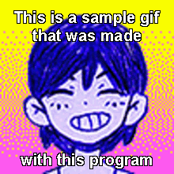

# omori-gif-creator
An application that lets you easily create those omori gifs with text.
 
 
Sample Gif:
 

# How to Use
- When you first launch the program, it will create an 'output.gif' file in the same directory as wherever you put the executable file.
- Do not remove the output.gif file while the application is running. If you accidentally delete it, it will create a new one the next time you launch the application.
- The output.gif file is where your gifs are saved.
- Everytime you click 'Save' it will overwrite the output.gif file with the new gif you made. Therefore, if you want to save your gif permanently, simply **copy** (not move) it to somewhere else.

# Notes
- The app has Omori, Sunny, Aubrey (Dream World and Real World), Kel (Dream World and Real World), and Basil. Mari and Hero aren't used as much in these gifs so I didn't bother adding them because I don't have much time right now.
- You'll notice that not every character has every emotion. This is because for some reason, the gifs I found for certain emotions had more than 256 colours and that makes it incompatible with the gif editing script I wrote. If anyone knows how to fix this issue, make a GitHub issue or pull request and I'll credit you.
- The top text splits into new lines if too long, however the bottom text will not do so, meaning it can't be too long. This is because I've never seen the bottom text more than one line, and it would make the gif look ugly if it was.
- Feel free to create a GitHub issue if you encounter any bugs.

# Web/API Version
- I also made this into an API that you can use in your web browser if you don't want to open an app every time. Just enter the following url:
https://strike1111.pythonanywhere.com/?input=!gifge|omori-dw-happy|top text|bottom text
- Just replace 'omori' with your character and 'happy' with the emotion, and of course replace 'top text' and 'bottom text' with your text (they can be blank).
- If you want to use the real world version of the character, add 'rw' at the end of the emotion, like this:
https://strike1111.pythonanywhere.com/?input=!gifge|aubrey-dw-neutralrw|top text|bottom text
- You can then right click (or tap and hold on mobile) to copy or save the gif.
- You can paste the link directly into discord, but the gif won't animate, so you'll have to copy it from the website.
- If the webpage just says "Error" then you messed something up in the url, or the character/emotion doesn't exist.

# List of Emotions (for API use)
- Omori: neutral, happy, ecstatic, manic, sad, miserable, angry, enraged, furious
- Sunny: neutral, angry, stabbed, afraid, stressedout
- Real World Aubrey: neutral, happy, sad, depressed, angry, afraid
- Dream World Aubrey: neutral, happy, sad, depressed, angry, enraged, afraid
- Real World Kel: neutral, neutral2, happy, ecstatic, sad, angry
- Dream World Kel: neutral, happy, sad, depressed, angry, enraged, afraid
- Basil: neutral, happy, depressed, afraid
